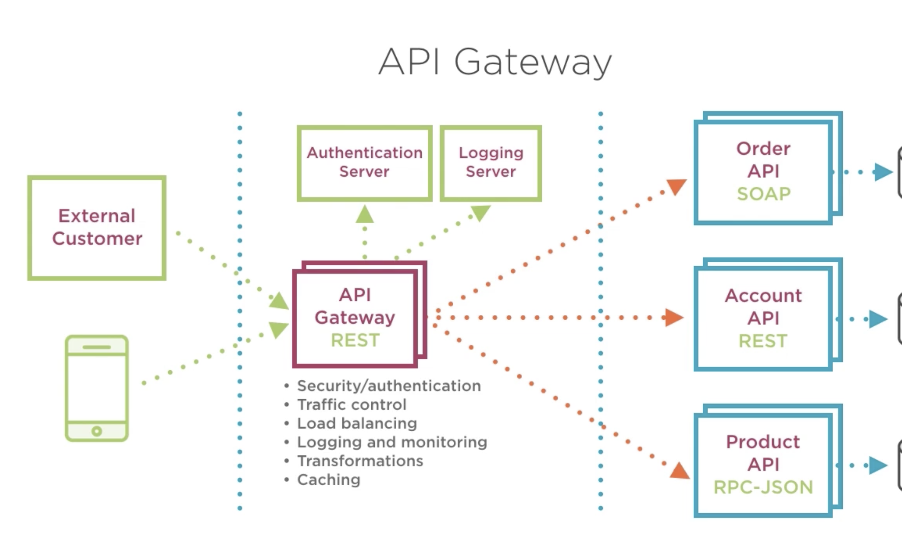

# Microservices

## Composition Pattern

### Broker Composition

RabbitMQ and microservices structure

### Aggregate

One big consumer consumes all microservices and provide output to client

### Chained

Chaining the request between microservices

### Proxy

API gateway sits like proxy without any implemantation

### Branch

Combining Aggregate, Chained, broker patterns

## Data Consistenct

### Two phase commit pattern

CAP theory is applicable, consistency over availability

First of all there should be a tranasaction manager which will handle all transactions in microservices.

When a transaction need occurs, tranx managers as services to if they are okey with next transaction, if every service says yes then trnx manager sends them transaction. if any one of tjhem says no, then trnx managers rollback the transaction.

So the steps are;

- Prepare
- Voting
- Commit or rollback

#### Drawbacks

Single point of failure. Trnx manager should has the state of the services.
Voting phase can wait not alive services
commit failure event vote yes
pending transactions will lock the resources until trnx manager succesfully commit the trnx
scaling out problem
anti-pattern for microservice architecture

### Saga Pattern

Trading atomicity for availability and consistency

this is basically distributed transaction way.
Split transaction into many requests
tracks each request
compromise atomicity

Saga pattern has Sagalog which is used for recording requests and compensating failed request. ie if first 3 request succes and last one fails, saga log sends 3 request for first three to undo operations

Saga execution coordinator is used by saga log to send, compensate requests.

### Eventual Consistency Approach

Comporise ACID, and Availability over consistency

the question we need to ask ourselves that if a data update or create operation is really needed for immediate usage.

we can use BASE approachh - basic availability, soft state and eventual consistency

## API Gateway

Example to use is **KONG API Gateway**